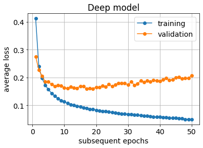
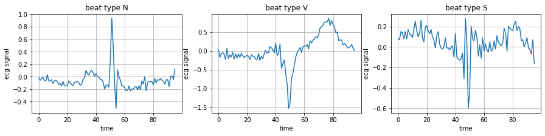
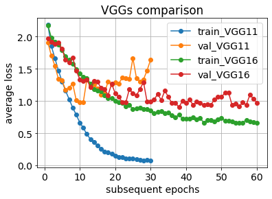
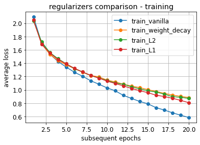
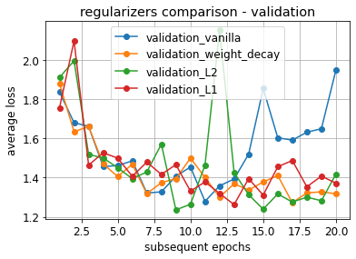

# machine-learning-applications
notes for Machine Learning -- Applications course

[timeline and grading](intro.pdf)

## lecture notes:
- [machine learning fundamentals](ML_fundamentals.pdf)
- [decision trees](Decision_Trees.pdf)
- [deep neural networks](Deep_NNs.pdf)
- [convolutional neural networks](CNNs.pdf)
- [computer vision: traditional methods](CV1.pdf)
- [computer vision: deep-learning methods](CV2.pdf)
- [recurrent neural networks](RNNs.pdf)
- [autoencoders and GANs](GANs.pdf)

## laboratory classes
1. Handwritten digits classification using MNIST dataset with Pytorch
- models: perceptron, deep fully-connected network, generic CNN
- various activations,
- overfitting,
- regularization, early stopping

[Colab notebook](mnist_in_3_flavours.ipynb)

2. ECG signal classification
- classifiers comparison: SVM, decision trees, random forests
- feature vectors

[Colab notebook](ecg_classification.ipynb)

3. Image classification using deep CNNs
- VGG, ResNet

[Colab notebook](advancedCNNs.ipynb)

4. Regularization
- L2 and L1 regularization implemented by hand

[Colab notebook](regularization.ipynb)

5. Augmentation in image processing, two separated tasks:
- take MNIST or CIFAR dataset, apply some simple geometric transformations (see e.g. [lecture](CV2.pdf)), and check if such dataset extending improves accuracy (take some CNN model from previous labs):
    * use simple transformations (e.g. flip, rotate, translate, scale) using [scikit-image](https://scikit-image.org/docs/dev/api/skimage.transform.html), or [open-cv](https://docs.opencv.org/4.x/da/d6e/tutorial_py_geometric_transformations.html)
    * or use [albumentations](https://github.com/albumentations-team/albumentations) library, demo: https://albumentations-demo.herokuapp.com/
    > * example of combining *albumentations* with pytorch *Dataset* is presented [here](pytorch_albumentations.ipynb)
    * in case of MNIST verify if applying flips or rotations > 45 deg improve accuracy or not, why?
- play with one-shot style transfer that might be also used for images augmentation (e.g. see [here](https://www.nature.com/articles/s41598-022-09264-z)), understand the idea, and run some exemplary code on your own images
> * papers:
>   * [Gatys original paper](https://www.cv-foundation.org/openaccess/content_cvpr_2016/papers/Gatys_Image_Style_Transfer_CVPR_2016_paper.pdf)
>   * https://arxiv.org/pdf/1904.11617v1.pdf 
> * code:
>   * https://github.com/limingcv/Photorealistic-Style-Transfer 
>   * https://github.com/KushajveerSingh/Photorealistic-Style-Transfer
    
## proposed seminars topics
- [list of proposed topics](seminars_topics.pdf)
- [link to form with seminars dates](https://docs.google.com/spreadsheets/d/1kSdDbUz7RgYlxWKyKmG3xpZ-5N3pH8psrlj1DUCY3wk/edit?usp=sharing)
